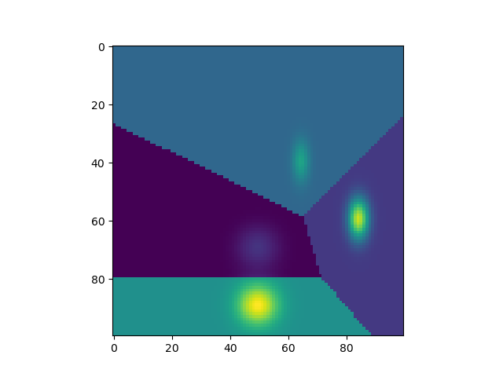
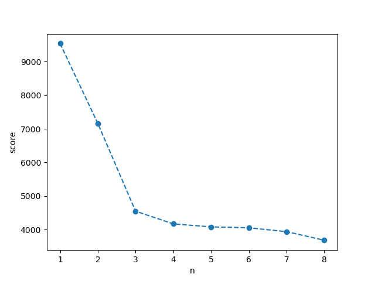
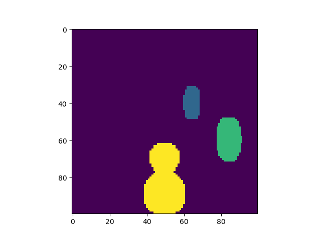
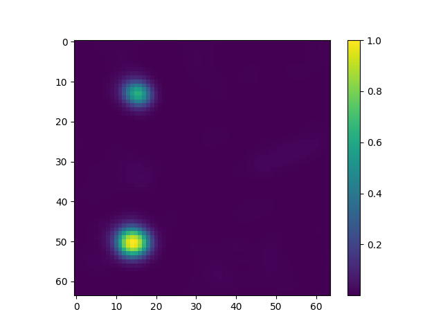
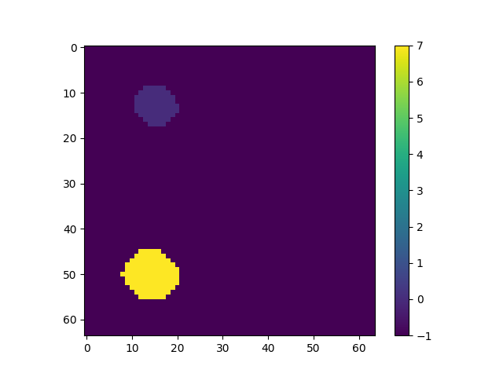

# Clusterization algorithms
Options are 
- Density cutOff + neighbour search
- Fourier space distribution
- K-means
- DBS scan

The density cutOff method works but is sensible to the parameters chosen.
The cluster module in the scikit-learn python package contains the main algorithms. Data is given as an array (# n of cells, spatial position of the cells) and a vector of sample weights ( the density field) .
## K-means
Tested on gaussian clusters. Partition the 2d space in clusters . Each cell is a data point with a weight equal to the field density. Partition is sufficiently accurate but cannot tell the number of clusters

|  |
|:--:|
|kmeans-cluster: 4 gaussian cluster , space partitioned using k-means and n=4 clusters   |

The score is not very informative on the optimal cluster size

|  |
|:--:|
|kmeans-cluster-score: 4 gaussian cluster , score in function of the number of clusters   |

## DBSCAN
Has arguments eps ( radius of two points to be neighbours, a value slightly above cell size works well) and min_samples ( can keep fairly low as the information is in the sample weight, for instance 1). 
The obove test gaussian clusters give the decomposition below
|  |
|:--:|
|dbs-cluster: 4 gaussian cluster in the data but only finds 3 as  two of the clusters are wrongly merged .   |

I have also applied to a test field and seems to work well

|  |
|:--:|
|droplet-slice: A slice of a simulation snapshot. Two clusters are clearly visible   |

|  |
|:--:|
|droplet-slice-dbs: A slice of the DBSCAN decomposition in clusters. Two clusters are clearly visible heare as well.   |

The decomposition is straightforward to do in python. Below an example code: 
```python
from sklearn.cluster import DBSCAN
import h5py
import numpy as np
f = h5py.File("droplet_id_test.h5",'r')
field=np.array(f["g1"]["psiR"])**2 +np.array(f["g1"]["psiI"])**2
x=f["g1"]["x"]
y=f["g1"]["y"]
z=f["g1"]["z"]
X,Y,Z=np.meshgrid(x,y,z,indexing="ij")
data=np.zeros(shape=(len(X.flatten()),3) )
data[:,0]=X.flatten()
data[:,1]=Y.flatten()
data[:,2]=Z.flatten()
shape=X.shape
decomposition=DBSCAN(eps=(x[1]-x[0]),min_samples=1).fit_predict(
    data,sample_weight=field.flatten() ).reshape(shape)
```