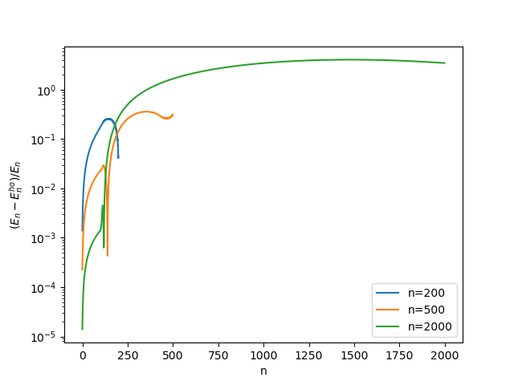
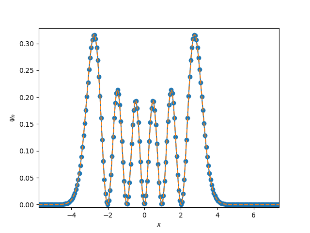
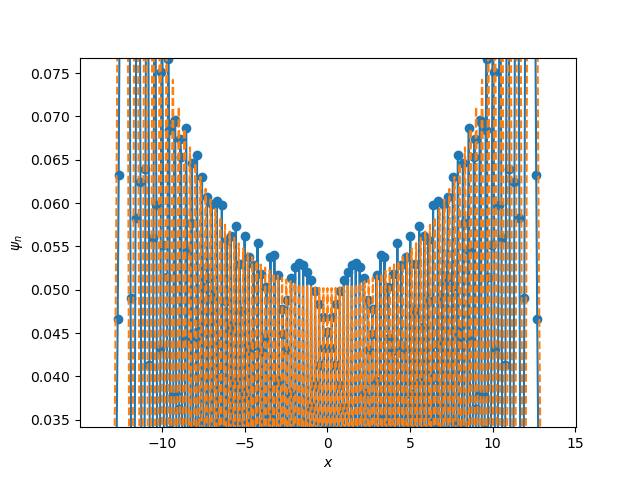
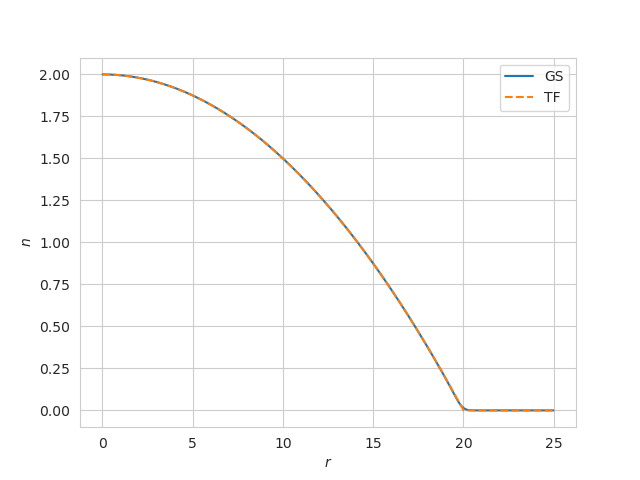
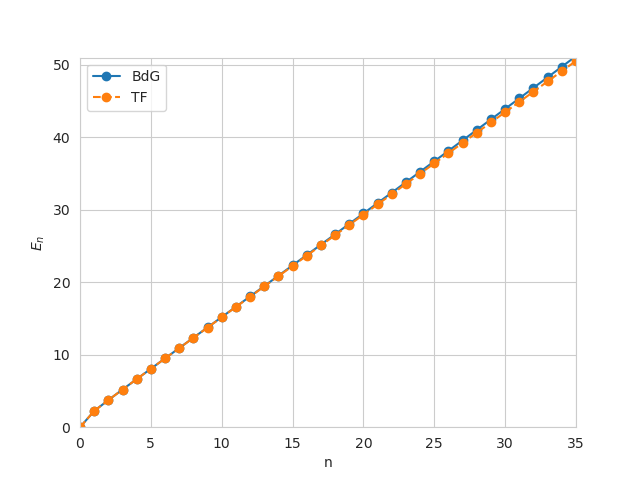
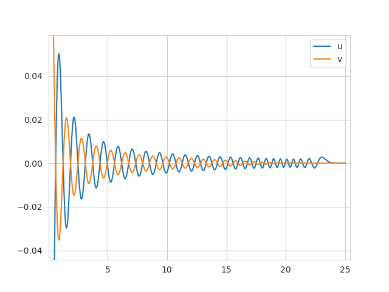

## Linearization of the Gross-Pitaevskii 
The GP equation is given by 
$$i\hbar\frac{\partial \phi}{\partial t}=\left( \frac{-\hbar^2}{2m}  \nabla^2 + V(r) + g|\phi|^2 \right)\phi  $$
On can look for solutions of the form 
$$ \phi(r) = e^{-i\mu t}\phi_0(r)\left( \sum_i u_i(r) e^{-i\omega_i t}  + v_i^*(r)e^{i\omega_i t}\right)$$
Looking for stationary solutions of this form on gets the equations

$$\hbar \omega 
\begin{pmatrix}
u \\ 
v
\end{pmatrix}=
\begin{pmatrix}
H_0 - \mu + 2g\phi_0^2 & g\phi_0^2 \\
-g\phi_0^2 & -(H_0 - \mu + 2g\phi_0^2) \\
\end{pmatrix}
\begin{pmatrix}
u \\ 
v
\end{pmatrix}
$$

where $H_0= \left( \frac{-\hbar^2}{2m}  \nabla^2 + V(r) \right)$ .
The functions $u_i(r)$ and $v_i(r)$ satisfy the relationships
$$\int u_iu_j^* - v_iv_j^* = \delta_{ij}$$
$$\int u_iv_j^* - v_iu_j^* = 0$$
For an uniform system solutions are plane waves $u(r)=ue^{ik\cdot r}$ and $u(r)=ue^{ik\cdot r}$ and using the normalizations above and $\mu=gn$ one gets the Bogoliubov spectrum
$$\hbar \omega = \sqrt{ \left( \frac{\hbar^2k^2}{2m} \right)^2 + \frac{\hbar^2k^2}{m}gn } $$ 
The quantity $\omega(k)$ also sets the growth rate of the condensate.
## Linearization of the Petrov equation
The petrov equation is given by $$i\hbar\frac{\partial \phi}{\partial t}=\left( \frac{-\hbar^2}{2m}  \nabla^2 + V(r) -3|\phi|^2 + \frac{5}{2}|\phi|^3  - \mu\right)\phi $$
By reapeating the process for the GP equation one gets
$$\hbar \omega u_i = \left(H_0 - \mu + \frac{5}{2}\phi_0^3 - \frac{9}{4}\phi_0^2\right)u_i + \left( \frac{3}{4}\phi_0^2 \right)v_i $$
$$-\hbar \omega v_i = \left(H_0 - \mu + \frac{5}{2}\phi_0^3 - \frac{9}{4}\phi_0^2\right)v_i + \left( \frac{3}{4}\phi_0^2 \right)u_i $$
Using $\mu = -3n +\frac{5}{2}n^{3/2}$ for an homogeneous system we get the spectrum
$$\hbar\omega=\sqrt{ \left(\frac{\hbar^2k^2}{2m}\right)^2 + \frac{\hbar^2 k^2}{m}\frac{3}{4}n} $$
There is not a maximum in the energy spectrum. The formation of droplets cannot be obtained at linear order.
## Implementation
If the hamiltonian is rotationally invariant one can works in spherical coordinates and the hamiltonian becomes $H_0=-\frac{\hbar^2}{2m}\frac{\partial^2 }{\partial^2 r} + \frac{2}{r}\frac{\partial}{\partial r} - \frac{l(l+1)}{r^2}$ with boundary conditions $\partial_r\psi_0(r)=0$ at the boundaries. Makes use of PETSC with MIRROR DM boundary ( to mimic Neumann boundary conditions ). The ground state is found using a Non linear Krylov Newton method. Updating the chemical potential along the simulations does not seem to work in spherical coordinates ( why ? , have tried different implementations yielding the same result  and tested each step ). Opted out for fixing the chemical potential insted of particle number. The ground state is found trough propagation in imaginary time follower by a non linear Newton-Krilov solver.
Can obtain very small accuracy. For $g=100,N=1000,\mu=15,R=10$ I get accuracy $||(H-\mu)\psi||<1e-9 $.
## BdG
### Harmonic oscillator 1D
Solution is sensible to space step for high energy excitations, where the function becomes very wiggly and it becomes difficult to resolve the ery fast oscillations
|  |
|:--:|
|relative-energy-difference: Relative energy difference between numerical and exact energy of excited state n obtained by exact diagonalization  |
|  |
|:--:|
|excited-state-n5: Wavefunction of harmonic oscillator with 500 discretization points, state n=5 obtained by exact diagonalization. Dashed lines are results from exact diagonalization.   |
|  |
|:--:|
|excited-state-n80: Wavefunction of harmonic oscillator with 500 discretization points, state n=80 obtained by exact diagonalization.   |

Similar results are obtained when considering an harmonic oscillator in 3D, getting agreements at low energy with $E_n = \hbar\omega(2n + l )$ where $l=0$
### Single component GP - Thomas Fermi Limit
in 3D the Thomas Fermi approximation yields the density profile
$$n(r)=n(0)\left(1 - V(r) \right)$$
$$n(0)=\frac{m\omega^2R^2}{2g}$$
$$R=\left( \frac{15}{4\pi} \frac{g}{m\omega^2}N\right)^{1/5}$$
  |
|:--:|
|TF-profile: Density for $\mu=200$ ,$g=200$ ,$n=1000$. a) GS is the numerical ground state of the GP equation , b) Thoams Fermi density profile  |

  |
|:--:|
|TF-profile: Excited states  for $\mu=200$ ,$g=200$ ,$n=1000$. a) GS is the numerical ground state of the GP equation , b) Thomas Fermi density profile  |

At low energy TF and numerical BdG agree for low energy excitation. High energy deviations are due in part because the TF limit is only approximate and in part because ground state is very wiggly and the resolution of the grid is not sufficient to resolve the excited states.
 |
|:--:|
|TF-profile: Excited state $n=50$ for $\mu=200$ ,$g=200$ ,$n=1000$. a) $u(r)$ Bogoliubov function b) $v(r)$ Bogoliubov function.
### Dynamic structure factor
Is defined as
$$ S(q,\omega)=\sum_n |<n| e^{iq\cdot r} |0 >  |^2 \delta(\omega- E_{n})$$ 
and can be computed once the eigenstates are known.
## Modeling
### Initial dynamics
It is likely a non linear instability. Is not captured using linear response. Possible theories:
- Lyapunov function method

### Late time dynamics
- Liquid droplet model
- Scattering homogeneous or attraction between droplets
- Tracking : region_props, just merge labels when isosurfaces merge
